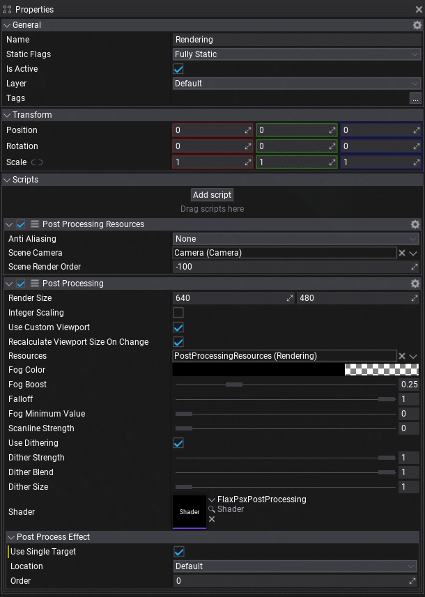
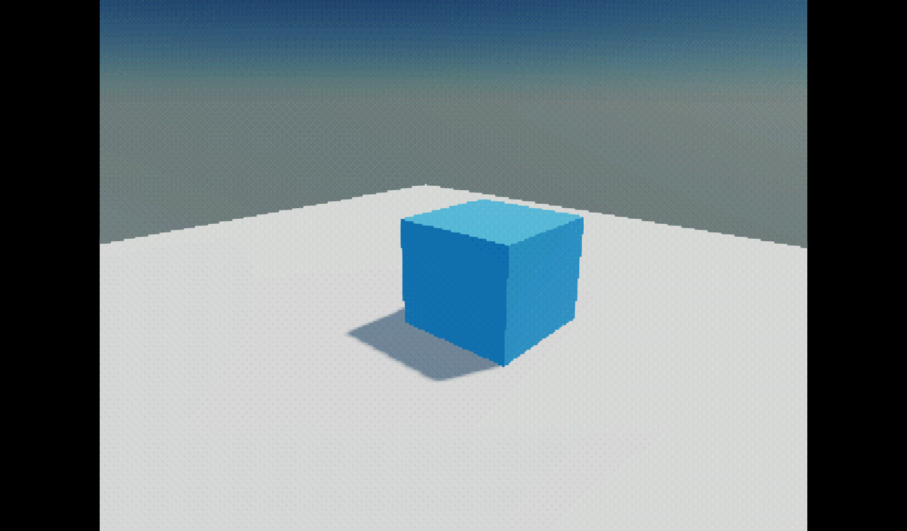
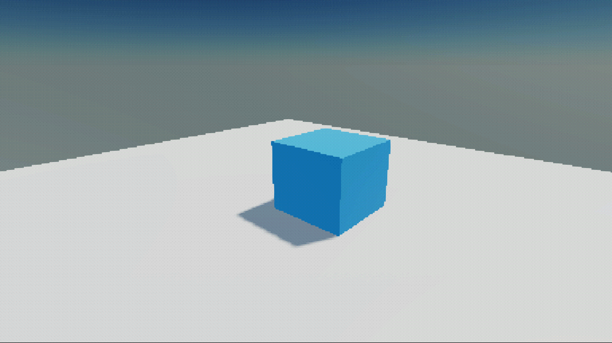

# Flax PSX
## A Flax Engine plugin that brings PSX-like visuals to your project

This plugin uses a custom post-processing effect that fully bypasses the engine’s internal scene rendering. Instead, it renders the scene directly into a GPU texture at the exact resolution you specify.
Because the scene is actually rendered at a low resolution — rather than rendered at full size and later pixelated — performance improves significantly. This approach is ideal for projects that rely on extremely low resolutions, delivering both visual accuracy and efficiency.

The main effects are:
* truncation of color range to PSX-style 5bpc precision
* PSX-style dithering
* integer scaling
* depth-based fog
  * other fog styles are planned
* very basic scanline effect

I will provide my PSX-style materials in the future. These feature:

* affine texture mapping
* vertex lighting
* screenspace vertex snapping (the mind-boggle wobble)
* PSX-style water caustics like used in tomb raider

## Status
- [x] PSX-Style post processing
- [ ] PSX-Style materials

This plugin has been tested with Windows 11 **only**.

## Installation

1. go to Tools → Plugins to open the Plugins window
2. click **Clone Project**
3. enter ``Flax PSX`` as *Plugin Name* and this repository as *Git Path*: `git@github.com:AcidicVoid/Flax-PSX.git`
4. create and empty actor in your project
    *  it's highly reccomended to disable all advanced graphics features like anti aliasing, camera artifacts, etc. if you're aiming for authentic retro visuals
5. add a **Flax PSX/PostProcessingResources** script to your actor
    * add your custom camera (present in the scene)
      * if using [CineBlend](https://github.com/GasimoCodes/CineBlend]), you can either reference the Custom Camera that contains the CineBlendMaster, or use the camera assigned to Camera.MainCamera, which also contains the CineBlendMaster — don't worry about the virtual cameras.
6. add a **Flax PSX/PostProcessing** script to your actor
    * add reference to the *PostProcessingResources* to the Resources slot
    * add the *FlaxPSxPostProcessing* shader to the Shader slot
    * activate *Use Single Target*
    * play around with the settings

It now should look something like this:  

If you're testing the plugin with the standard basic scene, you now should see something like this:

You also can use some other aspect ratio, just change *RenderSize* parameter

## Support

You'll find more on my projects [on Bluesky](https://bsky.app/hashtag/AcidicDev?author=acidicvoid.com)

If you like this project, please consider supporting me:  
**[DONATE](https://dono.acidicvoid.com/)**

### Sources

* PSX-Style dithering is designed according to Psy-Q documentation, page 424:  
https://psx.arthus.net/sdk/Psy-Q/DOCS/LIBREF46.PDF

* This repo was once forked from the example plugin project for Flax Engine. To learn more see the related documentation [here](https://docs.flaxengine.com/manual/scripting/plugins/index.html).
